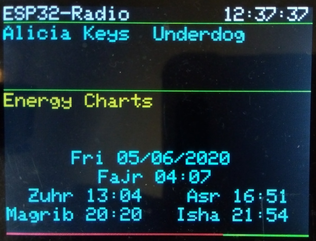
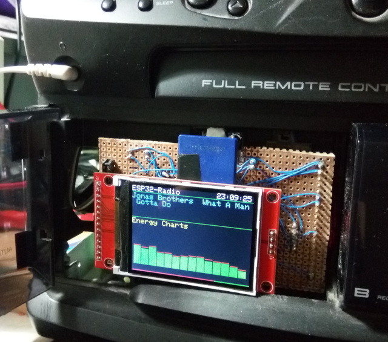
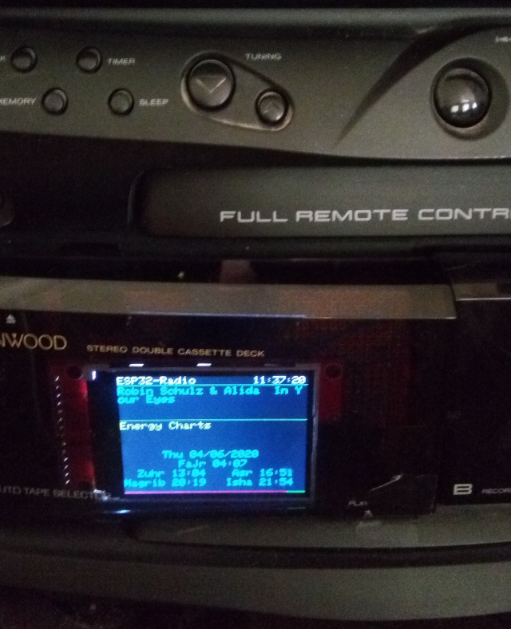
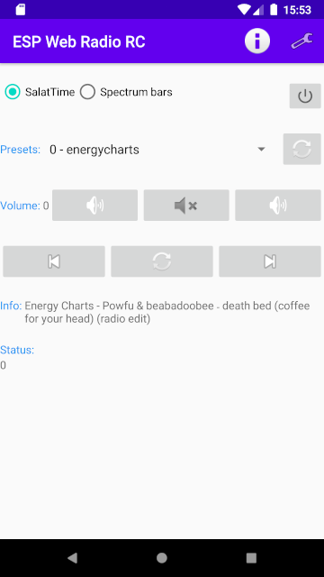

 # ESP32-Radio with SalatTime

It is a fork of my:<br/>
https://github.com/blotfi/ESP32-Radio-with-Spectrum-analyzer

I added my SalatTime (prayer time) routines and display them.<br/>
Also added Athan when the time occurs, it plays an azan.mp3 file.<br/>
Just drop it in the root of the sdcard to let it play it.<br/>

To display SalatTime:

     http://192.168.1.20/index.html/?st=1

To display Spectrum Analysis:

     http://192.168.1.20/index.html/?st=0
where ```192.168.1.20``` is your ESP32 radio local IP address.

If you press STOP, the display automatically switches to SalatTime.<br/>
I integrated the PCB prototype to the Tape player of an old HiFi Stereo that has AUX inputs.
The power is a 5V USB phone charger because I couldn't find a proper 5V inside the HiFi.<br/>


Versions:<br/>
**05/06/2020** First release<br/>







<br/>
My config file:
    
    # Example configuration
    # Programmable input pins:
    # gpio_00 = uppreset = 1
    # gpio_12 = upvolume = 2
    # gpio_13 = downvolume = 2
    # gpio_14 = stop
    # gpio_17 = resume
    # gpio_34 = station = icecast.omroep.nl:80/radio1-bb-mp3
    #
    # MQTT settings
    mqttbroker = none
    mqttport = 1883
    mqttuser = none
    mqttpasswd = none
    mqqprefix = none
    # Enter your WiFi network specs here:
    wifi_00 = ssid1/pw1
    wifi_01 = ssid2/pw2
    #
    volume = 72
    toneha = 0
    tonehf = 0
    tonela = 0
    tonelf = 0
    #
    preset = 0
    # Some preset examples
    preset_00 = energycharts.ice.infomaniak.ch/energycharts-high.mp3   #  0 - energycharts
    preset_01 = uk2.internet-radio.com:8024/ #  1 - DanceUK
    preset_02 = direct.franceinfo.fr/live/franceinfo-midfi.mp3  #  2 - franceinfo
    preset_03 = ch3.ice.infomaniak.ch/ch3-64.aac #  3 - Alger Chaine 3
    preset_04 = bbcwssc.ic.llnwd.net/stream/bbcwssc_mp1_ws-einws #  4 - BBC World Service
    preset_05 = ais-live.cloud-services.paris:8443/europe1.aac  #  5 - Europe1
    preset_06 = streaming.radio.rtl.fr/rtl-1-44-128       #  6 - RTL
    preset_07 = chai5she.cdn.dvmr.fr/rmcinfo        #  7 - rmcinfo
    preset_08 = bbcmedia.ic.llnwd.net/stream/bbcmedia_radio1_mf_p   #  8 - bbcmedia
    preset_09 = ice.stream.frequence3.net/frequence3-128.mp3    #  9 - Frequence 3
    preset_10 = streaming.radio.rtl.fr/rtl2-1-44-128    #  10 - RTL 2
    preset_11 = airspectrum.cdnstream1.com:8114/1648_128 #  11 - Easy Hits Florida 128k
    preset_12 = localhost/Select2020.m3u #  12 - Select2020
    preset_13 = localhost/Select2019.m3u #  13 - Select2019
    preset_14 = localhost/Select2018.m3u #  14 - Select2018
    preset_15 = localhost/Select2017.m3u #  15 - Select2017
    preset_16 = localhost/Select2014.m3u #  16 - Select2014
    preset_17 = localhost/KatyPerry.m3u #  17 - KatyPerry
    #
    # Clock offset and daylight saving time
    clk_server = pool.ntp.org                            # Time server to be used
    clk_offset = 0                                       # Offset with respect to UTC in hours
    clk_dst = 1                                          # Offset during daylight saving time (hours)
    # Some IR codes
    ir_18E7 = upvolume = 2
    ir_847B = downvolume = 2
    ir_609F = downpreset = 1
    ir_10EF = uppreset = 1
    ir_C03F = preset = 0
    ir_20DF = preset = 2
    ir_A05F = preset = 3
    ir_E01F = preset = 12
    ir_906F = preset = 13
    ir_8877 = preset = 14
    ir_9867 = preset = 15
    ir_E817 = preset = 16
    ir_40BF = preset = 17
    ir_44BB = mute
    ir_807F = stop
    # GPIO pinnings
    pin_ir = 35                                          # GPIO Pin number for IR receiver VS1838B
    pin_enc_clk = 27                                     # GPIO Pin number for rotary encoder "CLK"
    pin_enc_dt = 26                                      # GPIO Pin number for rotary encoder "DT"
    pin_enc_sw = 25                                      # GPIO Pin number for rotary encoder "SW"
    #
    pin_tft_cs = 15                                      # GPIO Pin number for TFT "CS"
    pin_tft_dc = 2                                       # GPIO Pin number for TFT "DC"
    #pin_tft_bl = 14                                     # GPIO Pin number for TFT backlight control, comment to not active
    #
    pin_sd_cs = 21                                       # GPIO Pin number for SD card "CS"
    #
    pin_vs_cs = 5                                        # GPIO Pin number for VS1053 "CS"
    pin_vs_dcs = 32                                      # GPIO Pin number for VS1053 "DCS"
    pin_vs_dreq = 4                                      # GPIO Pin number for VS1053 "DREQ"


First begin by putting the correct ssid / pw

    wifi_00 = ssid1/pw1
    wifi_01 = ssid2/pw2
    
if you don't have an sd card connected, then comment the line

    pin_sd_cs = 21
this is also valid for or the options that are different from yours (pin_ir = 35 ...)

You can connect to your

    http://192.168.1.???/config.html
to put this config

On the sdcard you must put MP3 files with no spaces or fancy characters in the filenames.
You can save the playlist as explained in https://github.com/Edzelf/ESP32-Radio/blob/master/doc/ESP32-radio.pdf

**Explanations in video**:<br/>
[](http://www.youtube.com/watch?v=aWUMx9HL5kk "ESP32 radio")

Enjoy programming under **CLion / PlateformeIO**<br/>
Check my other **video**:<br/>
[](http://www.youtube.com/watch?v=HP0uNj6u15I "CLion and PlatformIO")
<br/><br/>
Control the Web Radio with a remote control on Android, also made by me:<br/>
https://play.google.com/store/apps/details?id=com.embesystems.esp_radio_rc <br/>
<br/>
[](https://play.google.com/store/apps/details?id=com.embesystems.esp_radio_rc)
